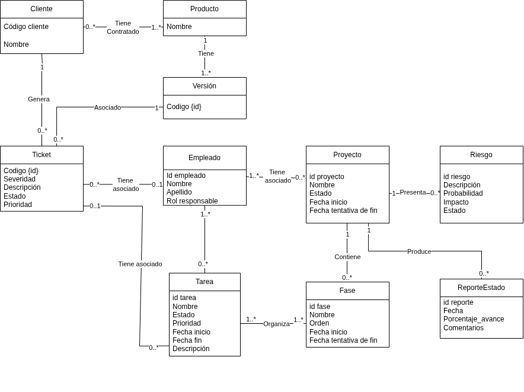

# Diagrama de dominio - Módulo Soporte

Este modelo representa las entidades principales del módulo de soporte a desarrollar para la compañía PSA y sus relaciones.

## Diagrama de dominio - Sistema general

A continuación se ilustra el modelo anterior unificado con el resto de los componentes del sistema

