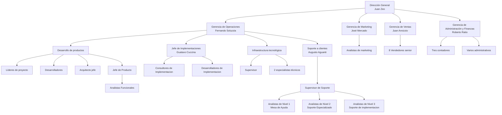

# R1. 1 Organigrama de la Empresa PSA (Praxis Systems Argentina)

## 1. Objetivo

Este documento presenta la estructura organizativa de la empresa Praxis Systems Argentina (PSA). El propósito es mostrar cómo se distribuyen jerárquicamente las responsabilidades y los roles dentro de la compañía.

---

## 2. Descripción General

La empresa PSA está liderada por el Director General, Juan Zeo, socio fundador y accionista mayoritario. Por debajo de su dirección, la compañía se organiza en cuatro gerencias principales, cada una a cargo de un socio minoritario: Operaciones, Marketing, Ventas y Administración y Finanzas.

Dentro de estas gerencias existen diversas áreas funcionales, equipos técnicos y roles específicos que permiten el desarrollo, comercialización, soporte y administración de los productos de la empresa (ERP, CRM y BI).

---

## 3. Diagrama Jerárquico

## 5. Glosario de Roles y Áreas del Organigrama

# Glosario de Roles y Áreas del Organigrama – PSA

| Término o Rol               | Definición resumida                                                                                   |
| --------------------------- | ----------------------------------------------------------------------------------------------------- |
| Dirección General           | Liderazgo máximo de la empresa. Encargado de la estrategia general y decisiones clave.                |
| Gerencia de Operaciones     | Área técnica y de desarrollo. Supervisa el ciclo de vida de los productos, soporte e infraestructura. |
| Gerencia de Marketing       | Encargada de publicidad, relación con clientes y análisis de mercado.                                 |
| Gerencia de Ventas          | Responsable de la comercialización y trato con los clientes.                                          |
| Administración y Finanzas   | Maneja facturación, impuestos, sueldos, tesorería y planificación financiera.                         |
| Desarrollo de productos     | Equipos que diseñan, desarrollan y prueban los productos ERP, CRM y BI.                               |
| Implementaciones            | Instalan y personalizan los productos en clientes, relevan necesidades y desarrollan adaptaciones.    |
| Soporte a clientes          | Área de atención a usuarios finales. Resuelve incidentes y consultas.                                 |
| Infraestructura tecnológica | Administra servidores, herramientas internas y evalúa infraestructura de clientes.                    |
| Líder de proyecto           | Coordina equipos técnicos por producto.                                                               |
| Arquitecto jefe             | Supervisa la arquitectura técnica general de los productos.                                           |
| Analista funcional          | Releva requisitos, diseña y prueba funcionalidades.                                                   |
| Consultor                   | Personal que adapta el producto al cliente durante la implementación.                                 |
| Supervisor                  | Responsable operativo de un equipo dentro de un área.                                                 |
| Especialista técnico        | Personal con conocimientos específicos en infraestructura o herramientas.                             |
| Vendedor senior             | Encargado de negociar y vender los productos a empresas.                                              |
| Contador                    | Profesional que gestiona aspectos contables de la empresa.                                            |
| Administrativo              | Personal de soporte en tareas operativas del área administrativa.                                     |

## 6. Fuente

Este organigrama fue elaborado a partir del documento oficial **"PSA v2020.pdf"**

📎 El archivo completo está incluido en la entrega como anexo, con nombre: [Psa v2020.pdf](https://drive.google.com/drive/folders/0B-OprvtGicVBYmpGUi1OMGsxLUU?resourcekey=0-9XgFyQ4ip67BE8zXErZ4Xg) .
